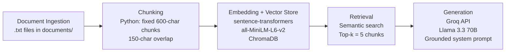

# Project 1 Planning: The Unofficial Guide

> Write this document before you write any pipeline code.
> Your spec and architecture diagram are what you'll use to direct AI tools (Claude, Copilot, etc.) to generate your implementation — the more specific they are, the more useful the generated code will be.
> Update the Retrieval Approach and Chunking Strategy sections if you change your approach during implementation.
> Update this file before starting any stretch features.

---

## Domain

This system covers student-generated reviews of Computer Science professors at the University of Florida, drawn from Rate My Professors and Reddit discussions. The knowledge captured — teaching effectiveness, exam difficulty, grading fairness, and lecture quality — is valuable because students use it to make high-stakes course registration decisions, yet it is impossible to find through official channels like the UF course catalog, which lists only course descriptions and never describes a professor's tendency to ramble in lecture, give unfair exams, or respond well to student feedback.

---

## Documents

| # | Source | Description | URL or location |
|---|--------|-------------|-----------------|
| 1 | Rate My Professors | Reviews for Peter Dobbins (COT3100, CIS4301) — mixed opinions on lecture quality, self-teaching required | `documents/rmp_Peter Dobbins.txt` |
| 2 | Rate My Professors | Reviews for Prabhat Mishra (CDA3101, CDA4630, CDA5155) — knowledgeable but condescending, pop quizzes, test-heavy | `documents/rmp_Prabhat Mishra.txt` |
| 3 | Rate My Professors | Reviews for Tamer Kahveci (CIS4301, CAP5510, CIS4310) — praised as engaging, hilarious, clear lecturer | `documents/rmp_Tamer Kahveci.txt` |
| 4 | Rate My Professors | Reviews for Christina Boucher (COP4533) — Reddit threads also warn against taking her | `documents/rmp_Christina Boucher.txt` |
| 5 | Rate My Professors | Reviews for Fatemeh Tavassoli | `documents/rmp_Fatemeh Tavassoli.txt` |
| 6 | Rate My Professors | Reviews for Neha Rani | `documents/rmp_Neha Rani.txt` |
| 7 | Rate My Professors | Reviews for Sara Rampazzi | `documents/rmp_Sara Rampazzi.txt` |
| 8 | Rate My Professors | Reviews for Vincent Bindschaedler | `documents/rmp_Vincent Bindschaedler.txt` |
| 9 | Rate My Professors | Reviews for William Anderson | `documents/rmp_William Anderson.txt` |
| 10 | Reddit r/ufl | Thread: "Cs major at UF" — general CS program discussion, professor warnings, department changes | `documents/reddit_best_cs.txt` |
| 11 | Reddit r/ufl | Thread: "Can we get thread/ list of your favorite professor(s) and classes?" — comparative recommendations | `documents/reddit_best_professors.txt` |

---

## Chunking Strategy

**Chunk size:** 600 characters

**Overlap:** 150 characters

**Reasoning:** Most Rate My Professors reviews are 200–500 characters long, so a 600-character chunk captures the vast majority of individual reviews in a single chunk without mixing unrelated reviews together. Reddit comments vary more in length; the 150-character overlap ensures that if a longer comment gets split across a boundary, both resulting chunks retain enough semantic context to remain meaningful and retrievable. Fixed character chunking is simple and consistent, but the overlap is critical because reviews often pack multiple claims into one paragraph (e.g., "lectures are useless but grading is fair") — without overlap, a split could strand the second half of an opinion in a chunk missing the professor's name or course context. If chunks were too small (e.g., 200 characters), most reviews would be fragmented and embeddings would lose meaning. If chunks were too large (e.g., 1200 characters), unrelated reviews from different professors would be combined, confusing retrieval when a student asks about a specific person.

---

## Retrieval Approach

**Embedding model:** `all-MiniLM-L6-v2` via `sentence-transformers`

**Top-k:** 5 chunks

**Production tradeoff reflection:** If deploying for real users with unlimited budget, I would consider `text-embedding-3-large` (OpenAI) or `all-mpnet-base-v2` for better semantic accuracy on nuanced opinion text, and potentially a domain-specific model fine-tuned on academic review data. Tradeoffs to weigh: (1) Latency — `all-MiniLM-L6-v2` is fast and runs locally, while API-hosted models add network latency; (2) Context length — some models support longer sequences, which matters if we later switch to larger chunks; (3) Domain accuracy — general-purpose embeddings may miss academic slang ("yaps," "self-teach," "flipped classroom") that a domain-tuned model would capture better.

---

## Evaluation Plan

| # | Question | Expected answer |
|---|----------|-----------------|
| 1 | What do students say about Peter Dobbins's teaching style? | Students describe lectures as rambling, hard to follow, filled with tangents, and "impossible to follow." Many say they stopped attending and self-taught from the textbook or YouTube videos. Some note he is passionate and takes feedback, but the consensus is that lectures are not useful. |
| 2 | How is Prabhat Mishra described in terms of personality and grading? | Students describe him as knowledgeable but condescending, with a Socratic teaching style that can feel intimidating. Grading is test-heavy with pop quizzes, few assignments, and stubborn grading. Some find him inspirational and funny; others say exams are unfairly difficult. |
| 3 | What do Reddit users say about Christina Boucher? | Reddit users warn against taking her. One user wrote "Remember, no Christina Boucher" and another called her "a terrible teacher and downright disrespectful to students." |
| 4 | What do students say about Tamer Kahveci's lectures? | Students consistently praise his lectures as fun, engaging, hilarious, and easy to follow. Multiple reviews call him one of the best CS professors at UF, noting he explains complex concepts simply and keeps students entertained. |
| 5 | What course do students say requires self-teaching with Peter Dobbins? | COT3100 (Discrete Structures). Reviews describe it as a "self-study bootcamp" where students learned primarily from the textbook because lectures were not helpful. |

---

## Anticipated Challenges

1. **Polarized reviews for the same professor create conflicting retrieval.** Rate My Professors has both 1-star and 5-star reviews for the same instructor (e.g., Dobbins has "best professor ever" and "worst teacher on the planet"). If the system retrieves only one extreme, the generated answer will be biased. The LLM needs enough context — or the prompt needs to explicitly ask it to synthesize conflicting viewpoints — to avoid presenting a one-sided answer.

2. **Chunk boundaries splitting multi-claim reviews.** A single review might say "Dobbins is a nice guy who responds to feedback, but his lectures are rambling and his exams don't match the practice material." If a chunk boundary splits this after "nice guy," the first chunk becomes misleadingly positive and the second chunk loses the professor's name. The 150-character overlap mitigates this, but it is not a guarantee for very long reviews.

---

## Architecture

---

## AI Tool Plan

**Milestone 3 — Ingestion and chunking:**
I will prompt Claude with my Chunking Strategy section (600 characters, 150 overlap) and a sample `.txt` file from `documents/`, and ask it to implement `chunk_text()` and `ingest_documents()` functions. I expect it to produce Python functions that read all `.txt` files from `documents/`, split them into overlapping chunks, and return a list of (text, metadata) pairs. I will verify the output by running the function on `rmp_Peter Dobbins.txt` and checking that no chunk exceeds 600 characters and that overlap is actually present between consecutive chunks.

**Milestone 4 — Embedding and retrieval:**
I will prompt Claude with my Retrieval Approach section (`all-MiniLM-L6-v2`, top-k=5) and `requirements.txt`, and ask it to implement `embed_chunks()` and `retrieve_chunks()` using `sentence-transformers` and `chromadb`. I expect it to produce functions that embed each chunk, store them in a persistent ChromaDB collection, and query the collection with a user question to return the top-k most similar chunks. I will verify by running a test query ("What do students say about Dobbins?") and checking that the returned chunks are actually about Peter Dobbins.

**Milestone 5 — Generation and interface:**
I will prompt Claude with my Retrieval Approach, the Groq API key setup from `.env`, and a sample retrieved context block, and ask it to implement `generate_answer()` that calls the Groq API with a grounded system prompt. I expect it to produce a function that formats retrieved chunks as context, constructs a system prompt forbidding hallucination, and returns a cited response. I will verify by running one of my evaluation questions and checking that the response uses only the provided context and cites sources.

---

## Stretch Features

### Hybrid Search (Semantic + BM25)

**Approach:** Combine ChromaDB cosine similarity with BM25 keyword ranking via Reciprocal Rank Fusion (RRF). For each query, retrieve top-k from both semantic and BM25, then fuse scores with `score = Σ 1/(60 + rank)` across both result sets.

**Why:** Our documented failure case — the Boucher query ("warn against taking") — failed because semantic search couldn't connect that phrasing to "Remember, no Christina Boucher." BM25 catches exact word matches even when embeddings miss the connection.

**Implementation:** Added `rank-bm25==0.2.2`, built `BM25Okapi` index from tokenized chunk corpus, implemented `HybridSearcher` class with `hybrid_search()` method, added Gradio checkbox to toggle hybrid mode.

**Expected improvement:** Boucher query should retrieve the correct Reddit chunk in top-5 due to keyword matching on "Boucher." Other queries should maintain or improve ranking.

### Chunking Strategy Comparison

**Second strategy tested:** 1000-character chunks with 200-character overlap (vs. original 600/150).

**Why:** Larger chunks capture more complete Reddit dialogues and multi-sentence reviews, potentially improving retrieval for broad questions. However, they risk merging unrelated reviews and diluting embeddings.

**Implementation:** Added `--chunk-size` and `--overlap` CLI args to `pipeline.py`, generated `chunks_1000_200.json` (93 chunks), built second ChromaDB collection `uf_professors_1000`, ran same 5 evaluation queries against both.

**Results:**
- **1000/200 wins:** Dobbins teaching style (all top-3 are Dobbins vs. 2/3 for 600/150) and Kahveci lectures (all top-3 are Kahveci vs. 2/3)
- **600/150 wins:** Boucher query (Reddit warning ranked #1 vs. #2 for 1000/200) and slightly better distance scores overall
- **Tie:** Mishra personality and Dobbins self-teaching course

**Conclusion:** 1000/200 is better for broad professor-overviews where multiple reviews need to be combined. 600/150 is better for isolating specific sentiments (like a single Reddit warning) because smaller chunks reduce dilution from adjacent content.
